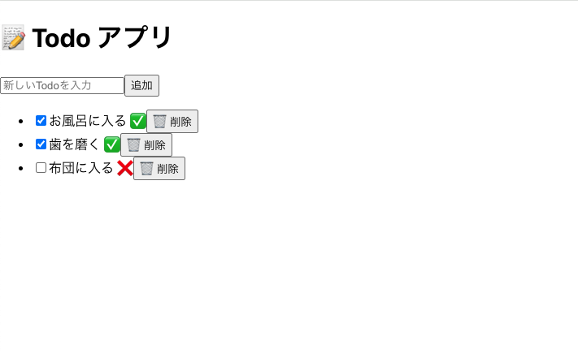

# Todo App

## 概要
このアプリケーションは、React と Spring Boot を使用して作成したシンプルな Todo アプリです。タスクを追加、編集、削除できます。


## インストール手順

1. リポジトリをクローンします：
 ```bash
 git clone https://github.com/your-username/todo-app-20250420.git
 ```

2. フロントエンドの依存関係をインストールします：
  ```bash
  cd frontend
  npm install
  ```

3. バックエンドを起動します：
  ```bash
  cd backend
  mvn spring-boot:run
  ```

4. フロントエンドを起動します：
  ```bash
  cd frontend
  npm start
  ```

## 使用方法
ブラウザで`http://localhost:3000`を開き、タスクを管理できます。
